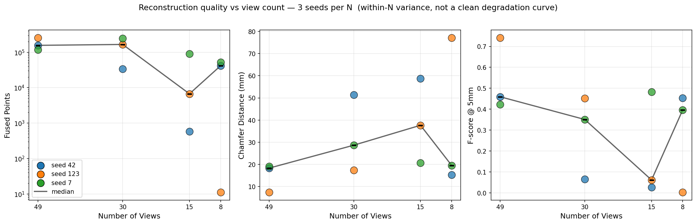
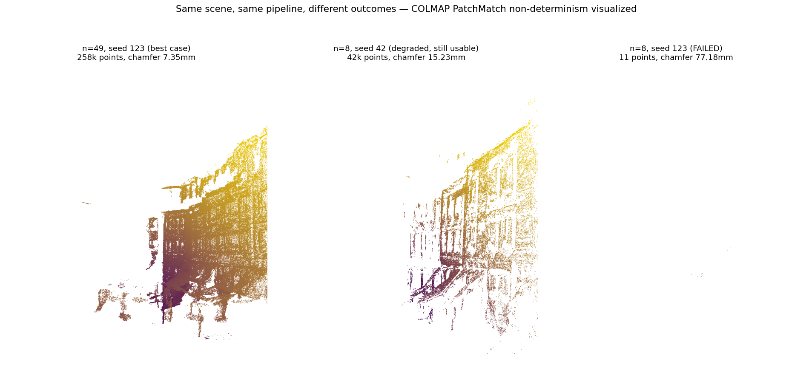

# sim-to-recon

Multi-view 3D reconstruction benchmark with stress-tested honest
evaluation under viewpoint perturbation, applied to COLMAP-based
dense MVS on DTU. This repo applies the evaluation discipline of
[sim-to-data](https://github.com/tyy0811/sim-to-data) — controlled
stress, honest failure reporting, explicit scope statements — to 3D
reconstruction, and extends it (V1.5) to a 3DGS densification
ablation and a cross-method three-regime comparison.

## Why This Matters

Multi-view 3D reconstruction pipelines are routinely benchmarked on
canonical datasets at full view density, then deployed in conditions
where view coverage, camera calibration, and image quality are all
degraded. Standard benchmarks report a single number per scene and
call it a day. They do not tell you *where* a pipeline fails when
input conditions degrade, or *how fast* quality collapses as the
input gets sparser.

The goal here is not novelty in reconstruction methodology. The
goal is to know what the pipeline does when the inputs are not what
the benchmark assumed.

## Summary of Findings

**V1 — COLMAP's default dense MVS produces a view-count degradation
curve whose within-N variance dominates the between-N trend below
n=15. Roughly one-third of runs at n=15 and n=8 produce degenerate
reconstructions (<1,000 fused points). Single-seed benchmarks — the
standard practice — hide this completely.** Across 3 independent
reconstructions per view count on DTU scan9 at 800×600: n=49 all 3
seeds usable (119k–258k fused points); n=30 non-degenerate but
highly variable (34k–246k points, chamfer 17.4–51.4 mm); n=15 only
seed 7 usable at 89,832 points, seeds 42 and 123 near-total failure;
n=8 seed 123 total failure at 11 points. Reporting the variance is
the contribution. Debugging path and methodology lineage in
[DECISIONS.md](DECISIONS.md) entries 14–16; V1 deep dive with
failure gallery and the n=8 median artifact in
[docs/V1.md](docs/V1.md).

**V1.5 — gsplat 3DGS densification is net-negative for PSNR at
scan9's 9k sparse init; the failure mode is calibration.** Six
recent sparse-view 3DGS papers attribute sparse-view failure to
"uncontrolled densification" and benchmark against vanilla 3DGS;
none publish the direct ablation — what happens if you disable
densification entirely. V1.5 runs that experiment and finds the
frozen baseline beats every densified recipe on PSNR at scan9's 9k
SfM init (21.32 dB 3-seed median vs 18.50 dB over-densified).
Mechanism: gsplat's default `grow_grad2d=2e-4` is calibrated for
~100k–200k-point inits; at 9k it fires on 82% of Gaussians per
refinement event and over-parameterizes to ~1M Gaussians. Day 11's
dense-init bounding experiment (at 257k init) confirms the frozen
advantage survives at higher init densities — narrowing from 3.66
dB to 2.34 dB but preserving sign. Day 12 ships a cross-method
three-regime frame (COLMAP MVS on geometric metrics, 3DGS on
novel-view synthesis, no forced apples-to-apples). Full V1.5
writeup: [docs/V1.5.md](docs/V1.5.md). Five-gap pre-commit authoring
taxonomy that emerged from the V1.5 chain with git-traceable
motivating examples: [docs/methodology.md](docs/methodology.md).

## The finding, visualized



*12 reconstructions — 3 seeds × 4 view counts. The within-N spread
at n=15 and n=8 is larger than the between-N trend — this is the
finding. Log scale on points so the 11-point degenerate run at n=8
seed 123 remains visible.*



*Three reconstructions of scan9. Left: best n=49 run. Middle: n=8
seed 42 — the pipeline with only 8 views, SfM initialization
happened to succeed. Right: n=8 seed 123 — same view count, same
pipeline, different seed, degenerate 11-point reconstruction. This
is the failure mode the variance scatter above is quantifying.
Uniform point size across panels — visible density differences are
real.*

| N | Registered | Median points | Range (points) | Median chamfer (mm) | Median F@5mm | Median F@10mm |
|---|-----------|---------------|----------------|---------------------|--------------|---------------|
| 49 | 37–38 | 156,711 | 118,793 – 257,684 | 18.31 | 0.459 | 0.639 |
| 30 | 23 | 166,169 | 34,035 – 245,557 | 28.65 | 0.351 | 0.490 |
| 15 | 10–11 | 6,698 | **579 – 89,832** | 37.65 | 0.061 | 0.154 |
| 8 | 3–7 | 41,656 | **11 – 51,815** | 19.53 | 0.397 | 0.585 |

*The within-N spread at n=15 and n=8 (bolded ranges) is larger than
the between-N trend — this is the finding. n=8 median chamfer is a
spurious ICP-collapse artifact from the 11-point degenerate run;
F@5mm is the more informative column at low N. Full mechanism and
failure gallery: [docs/V1.md](docs/V1.md).*

## Honest Scope

- Single dataset, single scene (DTU scan9 — one house-model scan)
- Single reconstruction method (COLMAP SfM + dense PatchMatch) with default parameters, no dataset-specific tuning
- 800×600 resolution on Modal A10G (not DTU's native 1600×1200)
- 3 seeds per view count, median ± range reporting; GPU PatchMatch non-determinism quantified rather than hidden
- Open3D ICP alignment for evaluation, not DTU's official mask-aware Matlab evaluator — accounts for most of the absolute-number gap vs published SOTA
- V1.5 gsplat extension is scan9-only at two init densities (9k sparse, 257k dense); full list of what V1.5 did not characterize in [docs/V1.5.md](docs/V1.5.md)

**Budget.** V1.5 shipped at ~$2.74 of the $50 Modal cap set in the
post-Day-9 plan. The binding constraint was time, not money.

## Quick Start

```bash
git clone https://github.com/tyy0811/sim-to-recon
cd sim-to-recon
conda env create -f environment.yml
conda activate simtorecon
pip install -e ".[dev]"

make deploy     # one-time: deploys sfm/dense/download functions to Modal
make data       # one-time: downloads DTU scan9 to Modal volume (~250MB)
make build      # builds the C++ calibration binary
make baseline   # runs a single n=49 reconstruction on Modal GPU (~10 min)
make stress     # runs the 3-seed view-count sweep on Modal GPU (~90 min, 12 runs)
make figures    # generates variance scatter + failure gallery + contrast figure
make test       # runs pytest (40 tests) + ctest (8 GoogleTest cases)
```

**Requires** a Modal account (`pip install modal && modal setup`)
and ~$1 of GPU credit for the full sweep.

## Engineering

- **Tests**: 40 pytest (chamfer / accuracy / F-score / alignment / failure regions, perceptual PSNR / SSIM / LPIPS, DTU loader, COLMAP runner rotation + workspace, sweep schemas, pipeline smoke) + 8 GoogleTest (calibration accuracy, corner detection, JSON serialization, edge cases)
- **CI**: ruff lint, pytest, CMake build + ctest on each push
- **Modal infrastructure**: deployed as `simtorecon-mvs` with persistent volumes (`simtorecon-dtu-data` caches scan9; `simtorecon-workspace` holds per-run artifacts). Feature extraction + SfM + PatchMatch + fusion run on A10G
- **Sweep is resumable**: each (view_count, seed) run writes its own JSON cache; re-running the sweep script skips completed entries
- **Per-run artifacts**: fused PLY + per-point error `.npz` + ICP transform saved for every reconstruction. V2 can recompute metrics or failure visualizations without re-running PatchMatch
- **Reproducibility**: SfM seeded via `pycolmap.set_random_seed`; GPU PatchMatch non-determinism documented and quantified rather than hidden

## C++ Calibration Module

Standalone C++17 camera calibration binary using OpenCV:

```bash
./build/cpp/calib/calib \
    --images path/to/chessboard/images \
    --pattern 9x6 \
    --square 25.0 \
    --output calib.json
```

8 GoogleTest cases cover object point geometry, corner detection,
calibration accuracy on synthetic data, edge cases, JSON
serialization, and intrinsics validity.

## Methodology, Decisions, and Deep Dives

The repo is stratified by reader depth. Top-level README (this
file) is the 90-second first-pass read. Deeper reads:

- **[docs/V1.md](docs/V1.md)** — V1 variance analysis deep dive:
  example reconstruction figure, SfM-origin-of-bimodal-failure
  mechanism, failure gallery, n=8 median ICP-collapse artifact,
  SOTA-gap explanation.
- **[docs/V1.5.md](docs/V1.5.md)** — V1.5 experimental writeup:
  Day 9 four-row densification ablation, Day 10 3-seed multi-seed
  sweep, Day 11 dense-init bounding, Day 12 cross-method
  three-regime table with transparent rediscovery correction, and
  "what V1.5 did not characterize."
- **[docs/methodology.md](docs/methodology.md)** — Five-gap
  pre-commit authoring failure-mode taxonomy (quantitative,
  structural, retrieval, scenario-coverage, single-seed
  generalization) with git-traceable motivating examples from the
  V1.5 chain. Retrieval gap has four instances including one
  post-commit catch during Day 13 polish.
- **[docs/roadmap.md](docs/roadmap.md)** — V1.5 → V2 motivation
  with three silent-failure-mode case studies; V2 trigger
  condition.
- **[DECISIONS.md](DECISIONS.md)** — 30 architectural decisions
  with pre-commit → observation → correction chains. Entries
  14–16 are the V1 methodology lineage; 17–30 cover V1.5.

The methodology thesis: pre-commit discipline is cheaper than
failure at this project's scale, and the failure modes are
explicit so the discipline is auditable. A reviewer skeptical of
any claim in this README can verify it by following the commit
refs in the DECISIONS entries backward to the motivating events.

## Methodological Lineage

Geometric sibling of
[sim-to-data](https://github.com/tyy0811/sim-to-data), which
applies the same evaluation philosophy to defect detection under
sensor shift.
