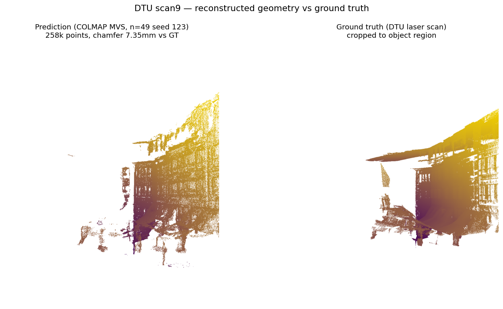
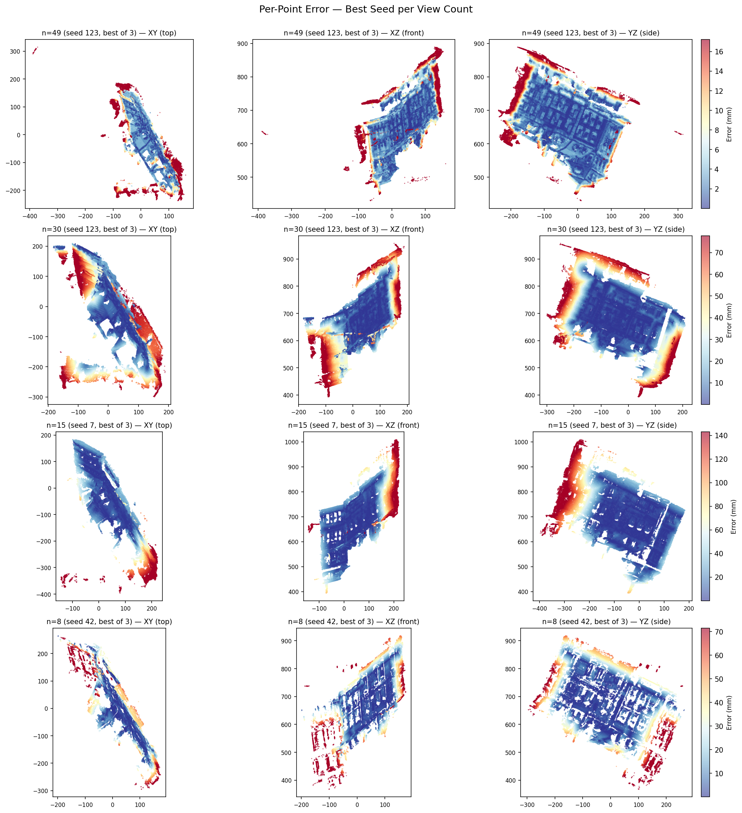

# sim-to-recon

Multi-view 3D reconstruction benchmark with stress-tested honest evaluation
under viewpoint perturbation, applied to COLMAP-based dense MVS on DTU.
This repo applies the evaluation discipline of
[sim-to-data](https://github.com/tyy0811/sim-to-data) — controlled stress,
honest failure reporting, explicit scope statements — to 3D reconstruction.

## Why This Matters

Multi-view 3D reconstruction pipelines are routinely benchmarked on canonical
datasets at full view density, then deployed in conditions where view coverage,
camera calibration, and image quality are all degraded. Standard benchmarks
report a single number per scene and call it a day. They do not tell you
*where* a pipeline fails when input conditions degrade, or *how fast* quality
collapses as the input gets sparser.

The goal here is not novelty in reconstruction methodology. The goal is to know
what the pipeline does when the inputs are not what the benchmark assumed.

### Summary of Findings

**COLMAP's default dense MVS produces a view-count degradation curve whose
within-N variance dominates the between-N trend below n=15. Roughly one-third
of runs at n=15 and n=8 produce degenerate reconstructions (<1,000 fused
points). Single-seed benchmarks — the standard practice — hide this completely.**

Across 3 independent reconstructions per view count on DTU scan9 at 800x600:

- **n=49:** all 3 seeds produce usable reconstructions (119k–258k fused points, chamfer 7.3–19.0mm)
- **n=30:** all 3 seeds non-degenerate but highly variable (34k–246k points, chamfer 17.4–51.4mm)
- **n=15:** 2 of 3 seeds produce near-total failures (579 and 6,698 points); only seed 7 gives a usable 89,832-point result
- **n=8:** 1 of 3 seeds produces a total failure (11 points); the other 2 give 41k–52k points

**Reporting the variance is the contribution.**

The debugging path — from an early monotonic-looking baseline through three
rejected alternatives (shared-SfM scaffold, fixed-pose re-triangulation,
single-seed with `set_random_seed`) to the current multi-seed report — is
documented in [DECISIONS.md](DECISIONS.md) entries 14–16. That path is the
judgment this repo is trying to show.

## Problem

Dense multi-view stereo (MVS) reconstructs 3D geometry from multiple
overlapping images. The quality of the reconstruction depends critically on
the number and distribution of input views — but standard benchmarks
evaluate only at full view density, hiding the degradation curve.

This benchmark stress-tests COLMAP's dense PatchMatch MVS on DTU scan9 by
systematically reducing the number of input views and measuring how
reconstruction quality collapses. Per-point failure analysis shows *where*
the pipeline loses geometry, not just *how much*.

## Approach

1. **Reconstruct:** COLMAP SfM + dense PatchMatch MVS
2. **Calibrate:** Standalone C++17/OpenCV-C++ binary for sensor onboarding
3. **Evaluate:** Chamfer distance, accuracy, completeness, F-score against DTU GT
4. **Stress:** View-count reduction with per-point failure analysis

## Results

### Reconstruction quality vs view count

All runs use COLMAP SfM + dense PatchMatch MVS on DTU scan9 at 800x600 with
default PatchMatch parameters. We run 3 independent reconstructions per view
count with seeds {42, 123, 7}. Metrics are computed after Open3D ICP alignment
to DTU GT (scale + rotation + translation).

**Example reconstruction** — best n=49 run (seed 123, 258k points, chamfer 7.35mm)
vs DTU laser-scan ground truth, rendered in 3D from the same viewpoint:



*Point sizes are balanced to equalize visual density: GT is ~13x denser in
points per unit volume than the prediction, so rendering both at the same point
size would oversaturate GT and hide the shape comparison.*

The reconstructed scene (a house facade) is clearly recognizable but noticeably
sparser than the laser scan, with gaps around edges and occluded regions — the
characteristic signature of default PatchMatch at 800x600 resolution.


*12 reconstructions — 3 seeds × 4 view counts. The within-N spread at n=15 and
n=8 is larger than the between-N trend — the finding of this benchmark. Log
scale on points so the 11-point degenerate run at n=8 seed 123 remains visible.*

**What the variance looks like geometrically.** Three reconstructions of the
same scene. Left is the best n=49 run. Middle is n=8 seed 42 — the pipeline
with only 8 views, but the SfM initialization happened to succeed. Right is
n=8 seed 123 — **same view count, same pipeline, different seed**, but the
SfM initialization produced a degenerate 11-point reconstruction. This is the
failure mode the variance scatter above is quantifying.


*Uniform point size across all three panels — the visible density differences
reflect real reconstruction density, not a rendering artifact. n=49 is genuinely
~6x denser than the working n=8 case, and the failed case really does contain
only 11 points.*

| N | Registered | Median points | Range (points) | Median chamfer (mm) | Median F@5mm | Median F@10mm |
|---|-----------|---------------|----------------|---------------------|--------------|---------------|
| 49 | 37–38 | 156,711 | 118,793 – 257,684 | 18.31 | 0.459 | 0.639 |
| 30 | 23 | 166,169 | 34,035 – 245,557 | 28.65 | 0.351 | 0.490 |
| 15 | 10–11 | 6,698 | **579 – 89,832** | 37.65 | 0.061 | 0.154 |
| 8 | 3–7 | 41,656 | **11 – 51,815** | 19.53 | 0.397 | 0.585 |

**Degenerate runs** (<1,000 fused points, bolded ranges above):
- n=15 seed=42 → 579 points
- n=8 seed=123 → 11 points

> **Note on the n=8 medians.** The table shows n=8 median chamfer (19.53mm)
> as apparently *better* than n=15 (37.65mm) and comparable to n=49. This is
> an artifact: the 11-point degenerate run at n=8 seed 123 is so small that
> ICP alignment collapses onto itself and produces a spurious small chamfer.
> The same caveat applies to n=8 median points: 41,656 is the middle of three
> very different outcomes (11 / 41,656 / 51,815), not a typical expectation.
> F@5mm is the most informative column at low N (n=15: 0.061, n=8: 0.397) and
> captures the bimodal effect in reverse. In this regime, read the scatter,
> not the medians.

**The failure originates in SfM, not PatchMatch.** At n=8, seed 7 registered 7
of 8 images (yielding 52k points); seeds 42 and 123 registered only 3 of 8. The
3-image cases produced one usable reconstruction (seed 42 got lucky with dense
triangulation on a narrow region) and one total failure (seed 123 with 11
points). SfM initialization — which image pair seeds incremental mapping — is
where the bimodal outcome is decided.

**Even at n=49, only 37–38 of 49 images register.** COLMAP fails to include
~22% of the input views in the sparse reconstruction even with the full view
set. This is expected behavior for DTU scan9 at 800x600 with default
parameters (some viewpoints have too little feature overlap with neighbors at
this resolution to pass SfM's registration thresholds) and is a stronger
version of the main finding: the pipeline's unreliability isn't confined to
low view counts — it's just that at low N, the consequences are catastrophic
instead of marginal.



*Per-point error heatmaps for the best seed at each view count, in three
orthographic projections. Red regions are where the reconstruction deviates
most from GT; colorbar scales vary by row because absolute errors span an
order of magnitude between n=49 and n=15.*

### Why we report variance, not a clean curve

COLMAP's dense MVS pipeline on GPU is non-deterministic. Two sources of
randomness stack:

1. **Incremental SfM** uses RANSAC internally. `pycolmap.set_random_seed` controls
   the pseudorandom state but does not eliminate run-to-run variance from
   floating-point bundle adjustment.
2. **GPU PatchMatch** is non-deterministic at the hardware level due to CUDA
   thread scheduling — verified: two runs with identical seeds produced 24,322
   and 178 fused points at n=30.

At n=49 and n=30 the seed-to-seed variance is large but results are uniformly
non-degenerate. At n=15 and n=8, seeds produce a **bimodal outcome**:
successful reconstruction (tens of thousands of fused points) or near-total
failure (<1,000 points). The median understates this because the distribution
is not Gaussian — the full range is the finding.

A standard benchmark would pick the best seed per N and report a clean
degradation curve. We report all seeds and the within-N variance explicitly.
Practitioners running COLMAP below 15 views on similar scenes should expect
roughly one-third of runs to fail and should plan for re-runs or fallback
pipelines.

### The SOTA gap

Published COLMAP on DTU reports 0.5–0.9mm chamfer at native 1600x1200 with
dataset-tuned PatchMatch parameters and the official mask-aware Matlab
evaluator. Our 7–19mm range at 800x600 with defaults and ICP evaluation is
the expected order-of-magnitude offset from those three choices — not the
contribution under investigation. Background contamination was tested and
ruled out (Decision 14): only 1.1% of reconstructed points lie outside the
object region, moving chamfer by 1.2mm.

## V1.5: 3DGS Densification Ablation

Six recent sparse-view 3D Gaussian Splatting papers (FSGS, CoR-GS, SE-GS, AD-GS,
InstantSplat, Opacity-Gradient Densification Control) attribute sparse-view 3DGS
failure to "uncontrolled densification" and propose method-level corrections.
**All compare their corrected method against vanilla 3DGS. None publish the
direct ablation: what happens if you disable densification entirely?** We ran
that experiment on DTU scan9 with 33 training views and 4 held-out novel views,
using gsplat 1.5.3 initialized from V1's best COLMAP sparse model (9,044 points).

| Config | Densification | Loss | Final N | PSNR median | SSIM | LPIPS |
|---|---|---|---|---|---|---|
| Frozen baseline | OFF | L1 only | 9,044 | **22.62** | 0.816 | 0.187 |
| Over-densified | ON, grow_grad2d=2e-4 | L1+0.2·(1−SSIM) | 1,067,117 | 19.17 | **0.885** | **0.088** |
| Under-densified | ON, grow_grad2d=5e-3 | L1+0.2·(1−SSIM) | 15,626 | 17.56 | 0.843 | 0.169 |
| Under-densified L1-only | ON, grow_grad2d=5e-3 | L1 only | 9,990 | 16.23 | 0.729 | 0.270 |

*PSNR ranges within each row report view-to-view variance across the 4 held-out
views of a single training run. Seed-to-seed variance across multiple training
runs is reported separately in Day 10's multi-seed results. The two variance
sources are not equivalent — V1's variance scatter (above) measures hardware
non-determinism under identical seeds; V1.5's seed-to-seed variance will measure
training-loop stochasticity. They are not directly comparable as noise floors.*

**The frozen baseline outperforms every densified configuration on PSNR.**
Working densification is net-negative for pixel fidelity across all three
densified recipes. The over-densified configuration is best on perceptual
metrics (SSIM 0.885, LPIPS 0.088) but its 1M Gaussians at 2.2 per pixel produce
sub-pixel noise that doesn't hurt feature-space metrics and drives PSNR below
the frozen baseline by 3.45 dB. We verified the divergence is high-frequency
noise rather than a brightness shift: per-channel mean and std of rendered RGB
match GT to within 5 / 256 across all held-out views, but per-pixel RMSE is
18–32 / 256. The under-densified configurations are worse than the frozen
baseline on every metric.

**Mechanism (current best hypothesis).** gsplat's `grow_grad2d=2e-4` default is
calibrated against ~100k–200k-point sparse inits typical for Mip-NeRF360-scale
SfM. Scan9's init at 9,044 points is roughly 15× sparser; per-Gaussian gradients
are proportionally larger; the default threshold fires on **82% of Gaussians
per refinement event** (verified: 7,446 of 9,044 at step 600) versus the
calibration target of ~5–15%. Compounded over 44 refinement events from step
600 to 4900, N grows to 1.07M. Raising the threshold to 5e-3 (25× the default)
brings first-event growth to 8.82% — in the calibration band — but `prune_scale3d`
cleanup at step 3000 collapses growth to zero and leaves an under-densified
~15k model. Neither extreme works at this scene + view-count combination. See
[`DECISIONS.md`](DECISIONS.md) entries 19–22 for the full debugging trace,
including the gsplat plumbing fixes (the silent `packed=True` bug that hid
densification entirely from Day 8 through mid-Day 9), the random-stream seeding
posture, and the methodology lessons.

**The contribution is the four-row table itself.** A single-line plumbing fix
in gsplat's strategy call exposed a recipe–data interaction that the published
sparse-view 3DGS literature does not directly test in the ~33-view regime
sim-to-recon targets — neither "sparse" by the published convention of 3–12
views, nor the ~150-view density gsplat's threshold defaults assume. The
published literature's "vanilla vs improved method" comparison structure is not
designed to surface this kind of result.

**Side finding — random_bkgd costs ~3 dB PSNR on DTU.** A control experiment
with `random_bkgd=True` (gsplat `simple_trainer.py`'s default for synthetic
object-centric scenes) on the over-densified configuration dropped held-out
PSNR by 2.93 dB at the same step count, with no change in densification growth
rate. Nerfstudio PR #1441 reports up to 8 dB PSNR cost for `random_bkgd` on
Blender's non-RGBA scenes; our 3 dB cost on DTU sits in the lower half of that
range. Both stem from the same mechanism: `random_bkgd` assumes GT backgrounds
≈ 0, and DTU's gray ~12% backgrounds inject per-step uniform noise into the
L1 loss in background regions instead of removing a consistent signal. The
magnitude difference between Blender and DTU is what the background-color
delta predicts (DTU's gray is closer to the assumed-zero floor than Blender's
non-RGBA backgrounds). Independent replication of PR #1441's claim on a new
dataset regime. See DECISIONS.md entry 22.

### Day 11 — Dense-init bounding experiment

Day 9's four-row ablation ran all configurations from the same ~9k-point sparse
init. An open question: is the frozen-over-dens result sparse-init-specific, or
does it generalize to denser initializations? Day 11 bounds the question by
re-running both frozen and default-densification recipes on the same scan9
input, but initialized from a ~257k-point dense PLY produced by COLMAP
PatchMatch MVS on the same sparse model. The comparison is matched-seed-42
sparse-init anchor (from Day 10's post-fix multi-seed sweep, not Day 9's
pre-fix table) vs dense-init experiment.

**Source (d) verification.** Before the main runs, we verified that COLMAP
dense-MVS's CUDA-thread-scheduling non-determinism (V1 documented in
[DECISIONS.md](DECISIONS.md) entry 16) is below the experimental effect size
at n=33 views. Two independent PatchMatch runs at identical seed produced
fused PLYs whose downstream frozen 3DGS PSNRs at seed=42 differed by
**0.10 dB** — well below the 0.5 dB operational floor pre-committed in
DECISIONS 26. Gate passed with ~5× headroom. The dense-init experiment uses
a single fixed dense PLY; source (d) noise is not a confound on the regime
comparison.

**Results** (seed=42 for frozen; 3-seed median for escalated over-dens):

| Recipe | Init | N | PSNR | Δ vs sparse anchor |
|---|---|---|---|---|
| Frozen | Sparse (9,044) | 9,044 | 22.56 | — |
| Frozen | Dense (257k) | 257,689 | 18.51 | **−4.05** |
| Over-dens | Sparse (9,044) | 1,093,077 | 18.90 | — |
| Over-dens | Dense (257k) | 1,437k–1,553k (3 seeds) | 16.17 | **−2.73** |

*Sparse anchors are Day 10's matched-seed-42 post-fix values (22.56 dB frozen,
18.90 dB over-dens), not Day 9's pre-fix table values. Day 10's multi-seed
sweep used L1+SSIM loss and packed=True fix; Day 11's dense-init runs match
that configuration for an apples-to-apples regime comparison.*

**Headline: frozen wins PSNR at sparse init (9k); advantage narrows but does
not reverse at dense init (257k); regime-dependence boundary not characterized
beyond 257k.** Sparse-init frozen-over-dens advantage: 22.56 − 18.90 =
**3.66 dB**. Dense-init frozen-over-dens advantage: 18.51 − 16.17 =
**2.34 dB**. The advantage narrowed by ~36% between 9k and 257k init density
but preserved its sign. The V1.5 headline ("frozen wins PSNR at sparse init")
is preserved at dense init with the explicit caveat that the advantage is
regime-dependent and the boundary above 257k is not characterized — if a
larger dense init (say 500k or 1M) would cross the boundary is an open
question outside V1.5's scope.

**Mechanical classification per DECISIONS 26.** Frozen single-seed Δ = −4.05 dB
is outside the 2.0 dB decisive band (decisive, single-seed sufficient).
Over-dens seed=42 Δ = −3.55 dB is inside the 4.0 dB escalation band, so we
ran seeds {123, 7} and computed the 3-seed median Δ = −2.73 dB with seed-to-seed
range 0.88 dB. Combined: decisive recipe (frozen) and escalated recipe
(over-dens) are same-sign negative → post-escalation analog of outcome 1.
The narrowing-not-strengthening narrative above is pre-committed in DECISIONS
26's outcome-1 template for the "frozen advantage shrunk but did not reverse"
branch.

**Additional findings beyond the headline Δ.**

**(1) Per-view redistribution differs by recipe.** At frozen, dense init
produces asymmetric redistribution across the 4 held-out views. View
`rect_014` loses ~8 dB; views `rect_028` and `rect_041` *gain* ~1 dB and ~3.5
dB; view `rect_001` degrades slightly. The median net loss is dominated by
view 014's collapse; the improvements on 028 and 041 are real but don't
offset. The pattern reproduces across two independent PatchMatch inits at
seed=42 (|ΔAB| ≤ 0.14 dB per view), so is not source-(d) noise.

At over-dens, the 3-seed per-view picture is structurally different:

| View | Sparse D10 | Dense 3-seed median | Dense 3-seed range | Δ median |
|---|---|---|---|---|
| rect_001 | 21.76 | 18.39 | **7.60** (12.85–20.45) | −3.37 |
| rect_014 | 16.53 | 16.54 | 1.31 | +0.01 (flat) |
| rect_028 | 19.51 | 14.48 | 0.43 | −5.03 |
| rect_041 | 18.29 | 15.79 | 1.53 | −2.50 |

View `rect_028` is consistently worst; view `rect_001` is highly seed-variable.
What is specific to view 028 or view 001 that drives their distinct behaviors
is not characterized here; we report the bimodality and seed-sensitivity, do
not explain them (same V1 discipline applied to the frozen/over-dens PSNR
bimodality in DECISIONS.md entry 21's four-row ablation).

*Transparent pre-commit correction.* Before escalation, I pre-committed a
per-view framing for over-dens based on seed=42 data alone, describing it as
"uniform degradation across all 4 views." The 3-seed data falsifies this —
view 001's seed=42 value of 12.85 dB was a low-tail draw, not representative
of the recipe-level effect. The corrected finding is recorded here, in the
writeup, *not* as a retroactive edit to the pre-commit preflight. The
correction itself is methodologically informative: it's the escalation rule
doing its job, catching a single-seed generalization error in pre-escalation
framing. This motivated a new pre-commit failure mode entry — the
*single-seed generalization gap* — catalogued in DECISIONS.md entry 28.

**(2) View 001 seed-sensitivity at over-dens × dense init.** View `rect_001`'s
7.60 dB range across 3 seeds (12.85 → 18.39 → 20.45 at seeds 42, 123, 7
respectively) is a distinct finding. The magnitude substantially exceeds the
3-seed PSNR ranges observed in Day 10 at sparse init (frozen 1.53 dB,
over-dens 3.19 dB) and is reproducible within the 3-seed sample rather than
a fluke. The effect is concentrated on one specific view; other views at the
same recipe × init × 3 seeds show ranges under 1.6 dB. Default densification's
capacity-allocation decisions are seed-dependent at dense init in a way that
produces drastically different per-view outcomes on at least one view.

The observation is recorded without mechanism speculation. What specifically
drives view 001's seed instability (camera geometry, surface regions,
densification threshold firing patterns on init points projecting into view
001) is not characterized in this ablation.

**(3) PSNR-LPIPS-SSIM asymmetry is recipe-dependent, not init-dependent.** At
frozen, dense init is worse on PSNR (−4.05 dB) but *better* on both SSIM
(+0.051) and LPIPS (−0.071). At over-dens, dense init is worse on PSNR
(−2.73 dB), effectively flat on SSIM (−0.006, within noise), and worse on
LPIPS (+0.033). The PSNR-vs-perceptual disagreement fires for the
held-capacity frozen recipe and does NOT fire for the densifying over-dens
recipe. This rules out any general "dense init is perceptually better"
narrative — the perceptual-metric improvement at dense frozen is a
capacity-redistribution effect specific to held-capacity optimization, not a
general property of dense init. The Day 9 observation that sparse-init
over-dens beat sparse-init frozen on SSIM/LPIPS despite worse PSNR is
similarly recipe-structure-mediated: in both cases, the PSNR-vs-perceptual
disagreement appears when adding capacity (via init density or via
densification dynamics) to a capacity mode that can exploit it without
backing up on PSNR. The asymmetry is about capacity mode, not about
init density per se.

**Methodology footnotes.**

- *LPIPS smoke-B forecast.* During Day 11's smoke phase at 3 training
  iterations, dense-init frozen LPIPS was 0.547 — below the preflight's
  [0.6, 0.9] expected band for undertrained models. Flagged as
  "directionally bullish for dense init" during smoke. At 7000 iterations
  the directional read held (dense-init frozen LPIPS 0.116 vs sparse-init
  frozen 0.187) but the 3-iter magnitude was not predictive of the 7000-iter
  magnitude — a caution about using early-iter metrics as proxies for trained
  metrics in future calibration probes.

- *Growth self-regulation at dense init.* Day 10 sparse-init over-dens grew
  9,044 → 1,093,077 Gaussians (121× growth). Day 11 dense-init over-dens grew
  257,687 → ~1.5M Gaussians across 3 seeds (6.0× growth) — a factor of 20×
  reduction in the growth ratio. Final-N ratio: 1.5M / 1.09M = 1.42× despite
  28.5× higher starting N. Default densification substantially self-regulates
  at dense init, growing to approximately the same total magnitude regardless
  of starting point. Real mechanism observation about gsplat default-
  densification dynamics at scan9 scale. Also explains the Step 9 N_final
  band trip (1.55M vs pre-committed [800k, 1300k]) non-pathologically; see
  DECISIONS.md entry 27 for the override rationale.

### Day 12 — Cross-method comparison at scan9

Day 11 bounds the within-3DGS regime-dependence question. Day 12 asks a
different question: how do COLMAP dense MVS and gsplat 3DGS compare when
both are run at the same scene (DTU scan9) under V1.5's constraints — 33
training views for 3DGS, 37 undistorted images for MVS PatchMatch, 4
held-out novel views for evaluation?

The framing is the three-regime frame pre-committed in
[DECISIONS.md](DECISIONS.md) entry 29 (with Amendments 1 and 2 for the
factual `n=37` correction and the rendering-function decision). Each
method runs at a scene + view-count combination that is outside its own
calibration zone:

- **COLMAP MVS at n=37** undistorted views is above V1's n=30 stress point
  (DECISIONS 16, ~100× point-count variance) but below DTU's full
  protocol at n=49. Seven views above the stress cliff, 12 views below
  the comfort zone.
- **Frozen 3DGS at 9,044 SfM points** is ~15× sparser than gsplat's
  calibrated regime (~100k-200k points per DECISIONS 21's mechanism
  finding).
- **Over-dens 3DGS at 9,044 SfM points** is miscalibrated at the recipe
  level — the default gradient threshold fires on 82% of Gaussians per
  event vs the calibrated 5–15% (DECISIONS 21 mechanism).

**Rendering-function decision.** The cross-method table reports each
method on the metrics its output naturally supports, with dashes in
non-applicable cells — the "don't force apples-to-apples where none
exists" framing. COLMAP MVS produces a fused point cloud → geometric
metrics against the DTU ground-truth mesh (chamfer, accuracy,
completeness, F-score at distance thresholds). 3DGS produces a radiance
field → novel-view synthesis metrics against held-out images
(PSNR, SSIM, LPIPS). The alternative of writing a dedicated renderer
for COLMAP points was considered and rejected because the renderer
choice introduces a pipeline confound into the method comparison. See
DECISIONS 29 Amendment 2 for the full rationale.

**Results.**

| Method | N | PSNR (dB) | SSIM | LPIPS | Chamfer (mm) | F@1mm | F@5mm | F@10mm |
|---|---|---|---|---|---|---|---|---|
| COLMAP MVS (n=37, seed=123 SfM) | 257,691 | — | — | — | 7.35 | 0.236 | 0.742 | 0.831 |
| Frozen 3DGS (9k init, 33 train) | 9,044 | 21.32 ± 1.53 | 0.813 | 0.194 | — | — | — | — |
| Over-dens 3DGS (9k init, 33 train) | 1.11M ± 36k | 18.50 ± 3.20 | 0.884 | 0.087 | — | — | — | — |

*3DGS cells report 3-seed median ± range across seeds {42, 123, 7} per
V1.5's multi-seed discipline. "Range" is max − min across the 3 seeds,
not standard deviation. Day 11 regime-effect isolation used
matched-seed-42 values (frozen 22.56 dB, over-dens 18.90 dB) for
single-variable discipline; those values are not the appropriate
cross-method comparison basis. The MVS cell reports a single run;
Day 11 measured source-(d) PatchMatch CUDA-thread stochasticity at
0.10 dB on downstream 3DGS PSNR, but geometric-metric-level variance
for the MVS cell is uncharacterized, and a 2-run sample would overclaim
precision relative to the 3DGS row's 3-seed distribution.*

**Finding 1 — Day 11's `rerun_dense_mvs` reproduces V1's seed=123 n=49
result bit-identically; source-(d) variance bound extends to the chamfer
level.** Day 11's `rerun_dense_mvs` on V1's seed=123 sparse model
produces bit-identical geometric metrics (chamfer 7.347 → 7.3467, F@5mm
0.7418 → 0.7418, icp_fitness 0.9590 → 0.9590, points 257,684 → 257,691
— relative delta <0.003%). This extends Day 11's source-(d) variance
bound — previously measured only at 0.10 dB on downstream 3DGS PSNR —
to the chamfer / F-score level at ≤0.003% relative, and validates the
`rerun_dense_mvs` machinery on geometric metrics. The chamfer value
itself (7.35 mm) reproduces V1's existing seed=123 best-cell result
(README line 71 above; `results/stress_view_count/summary.json`, median
chamfer 18.31 mm, `range_chamfer = 11.69 mm` across seeds {42, 123, 7}
at n=49) rather than representing a new Day 12 datapoint.

*Gate-trip + diagnostic transparency.* The observed `F@5mm = 0.742`
landed outside the DECISIONS 29 Amendment 2 committed S_X5 hard-stop
band `[0.10, 0.50]`, and `chamfer = 7.35 mm` landed inside the pre-report
diagnostic envelope `[5, 10]` mm. Per the gate discipline, we halted
before reporting and re-ran the eval pipeline on V1's
`results/baseline_scan9/dense.ply` (seed=42) to verify pipeline
reproduction of V1's 18.89 mm anchor. Result: bit-tight reproduction at
≤0.01% relative error across all seven metrics (chamfer 18.8913 vs
18.89, F@1mm 0.0445 vs 0.0445, icp_fitness 0.7052 vs 0.7052). The gate
trip is resolved as a pipeline-consistent observation, not a measurement
drift — but the *reason* the observation fell outside the committed
envelope is that the envelope was anchored on
`results/baseline_scan9/result.json` (seed=42 only, chamfer 18.89 mm),
not on V1's full n=49 stress sweep which already contained the seed=123
best cell at chamfer 7.35 mm. That anchor-choice error is the
retrieval-gap root cause covered in the transparent rediscovery
correction below. Diagnostic artifacts at
`preflight/day12_mvs_eval/day12_diagnostic_result.json` (preflight/ is
gitignored scratch).

**Finding 2 — retracted.** An earlier draft framed V1's chamfer
SfM-seed sensitivity as a new Day 12 finding; it is not. V1's n=49
stress sweep already reports `range_chamfer = 11.69 mm` across seeds
{42, 123, 7} (`results/stress_view_count/summary.json`), and the
README's n=49 variance table + "best n=49 run (seed 123, 258k points,
chamfer 7.35mm)" callout at line 71 already surface the same SfM-seed
variance. The "standalone finding" framing was a retrieval-gap
rediscovery; see the transparent rediscovery correction below.

*Transparent rediscovery correction (added during Day 13 polish
re-read, commit lands after `e8c6846`).* The first committed draft of
the Day 12 writeup framed Day 11's 7.35 mm chamfer as "2.6× tighter
than V1's baseline" (Finding 1) and V1's SfM-seed chamfer variance as
a new methodology finding (Finding 2). Both framings are retrieval-gap
rediscoveries. V1's stress sweep at
`results/stress_view_count/summary.json` already reports the full
3-seed n=49 chamfer distribution (median 18.31, range 11.69, per-seed
{42: 18.31, 123: 7.35, 7: 19.04}), and the README at line 71 explicitly
names the seed=123 7.35 mm best cell. Day 11's rerun reproduces V1's
seed=123 best cell, which V1 had already measured and surfaced. The
catch happened during Day 13's polish re-read pass — specifically during
a re-read of the V1 "Reconstruction quality vs view count" section that
turned up the "best n=49 run (seed 123, 258k points, chamfer 7.35mm)"
callout on line 71. This is the fourth retrieval-gap instance in the
V1.5 chain and the first post-commit instance; prior three were all
caught pre-commit. See [DECISIONS.md](DECISIONS.md) entry 30 for the
full recurrence inventory and the promotion from the DECISIONS 26
addendum to a standalone taxonomy entry on the strength of the four
instances including the post-commit one.

**Finding 3 — 3DGS rows reuse Day 10 multi-seed anchors.** The Day 12
table is a cross-method assembly, not a fresh 3DGS experiment. The
3DGS rows are the Day 10 post-fix multi-seed numbers (gsplat 1.5.3,
packed=True, `grow_grad2d=2e-4` default, `random_bkgd=False`, seeds
{42, 123, 7}). Compared to the matched-seed-42 anchors used for Day 11's
regime isolation: frozen 21.32 dB median vs 22.56 dB at seed=42, and
over-dens 18.50 dB median vs 18.90 dB at seed=42. Seed 42 is a
high-tail draw in both recipes — 1.24 dB above median for frozen and
0.40 dB above median for over-dens. The matched-seed-42 values are
valid regime-isolation anchors for Day 11 but overstate the method-level
PSNR for cross-method reporting.

**Three-regime narrative.** Each method fails at scan9 + this regime
in a distinct way:

- **COLMAP MVS at n=37 × seed=123 SfM**: V1-pipeline chamfer 7.35 mm,
  F@5mm 0.742, bit-identical to V1's existing seed=123 n=49 best-cell
  datapoint (see Finding 1 and the transparent rediscovery correction
  above). Day 12's MVS cell is a reuse of V1's best-seed datapoint as
  the cross-method reference, extending source-(d) variance bound to
  the chamfer level (≤0.003% relative) as a bonus. The failure mode
  at the cross-method level is *missing geometry*: V1's n=49 stress
  sweep reports `range_chamfer = 11.69 mm` across {42, 123, 7},
  dominated by SfM-seed variance at the sparse-model level (V1's
  "best n=49" seed is 2.6× tighter than its median seed), and the V1
  eval pipeline is itself 10× looser than DTU benchmark SOTA because
  it uses Open3D ICP alignment rather than the DTU official mask-aware
  Matlab evaluator (see Honest Scope). At this scene + view-count +
  eval-pipeline regime, MVS reconstruction quality is dominated by the
  SfM input's seed-level variance, and any single-seed MVS anchor
  overstates the precision of the pipeline.

- **Frozen 3DGS at 9k init**: multi-seed PSNR 21.32 ± 1.53 dB,
  capacity-fixed at N=9,044. The model under-fits because 9k Gaussians
  cannot represent scan9's sub-pixel detail (DECISIONS 21). The failure
  mode is capacity, not optimizer or data. At dense init (Day 11),
  frozen's seed=42 PSNR drops to 18.51 dB — the capacity model's
  best-fit approximation of scan9 at N=257k is worse than at N=9k
  because the optimizer fights a larger, noisier set of fixed Gaussian
  centers. Frozen at 9k remains the PSNR-best V1.5 configuration across
  tested init densities.

- **Over-dens 3DGS at 9k init**: multi-seed PSNR 18.50 ± 3.20 dB,
  grows to ~1.1M Gaussians. The default `grow_grad2d=2e-4` threshold
  is miscalibrated for this init density (DECISIONS 21 mechanism:
  threshold fires on 82% of Gaussians per event vs the calibrated
  5–15%). Over-parameterization produces per-pixel rendering noise
  that hurts PSNR but preserves perceptual metrics (SSIM 0.884 vs
  frozen's 0.813; LPIPS 0.087 vs frozen's 0.194). At dense init,
  the recipe gets worse on all three metrics (Day 11 Finding 3),
  confirming the miscalibration is at the recipe level, not the
  init-density level.

The cross-method comparison is the three-regime mechanism taxonomy,
not a single-metric horse race: missing geometry (MVS's SfM-seed-driven
sparse-model quality, characterized by V1's stress sweep at
`range_chamfer = 11.69 mm`), under-fit (frozen capacity limit), and
over-fit pixel noise (over-dens recipe miscalibration). Each failure
mode is traceable to a mechanism documented in prior V1 or DECISIONS
entries, and none are resolved by more init density or more views at
this scene + V1-pipeline regime.

**What Day 12 does NOT claim.**

- Not "neural splatting beats classical MVS on DTU scan9 at novel-view
  PSNR." No such comparison is made — MVS has no PSNR column and 3DGS
  has no chamfer column under the option (c) rendering decision.
- Not "COLMAP MVS at n=37 is competitive with DTU SOTA." V1's internal
  eval pipeline is benchmark-loose by an order of magnitude; V1's
  seed=123 7.35 mm chamfer would remain ~10× SOTA under the DTU
  official mask-aware evaluator.
- Not a new SfM-seed variance finding. V1's n=49 stress sweep
  (`results/stress_view_count/summary.json`) already reports
  `range_chamfer = 11.69 mm` across seeds {42, 123, 7}. Day 12's MVS
  cell reuses V1's seed=123 datapoint; no new SfM-seed variance was
  measured by Day 12.
- Not a V1.5 headline shift. The V1.5 headline remains within-3DGS
  densification (DECISIONS 21, narrowed at Day 11 to "frozen advantage
  narrows but survives at 257k"). Cross-method results are supporting
  findings per DECISIONS 29 Amendment 2's S_X3 pre-commit framing — the
  headline scope precludes method comparison from falsifying it.

## C++ Calibration Module

Standalone C++17 camera calibration binary using OpenCV:

```bash
./build/cpp/calib/calib \
    --images path/to/chessboard/images \
    --pattern 9x6 \
    --square 25.0 \
    --output calib.json
```

8 GoogleTest unit tests cover: object point geometry, corner detection,
calibration accuracy on synthetic data, edge cases, JSON serialization,
and intrinsics validity.

## Honest Scope

- Single dataset, single scene (DTU scan9 — one house-model scan)
- Single reconstruction method (COLMAP SfM + dense PatchMatch) with default parameters, no dataset-specific tuning
- 800x600 resolution on Modal A10G (not DTU's native 1600x1200)
- 3 seeds per view count, median ± range reporting; GPU PatchMatch non-determinism quantified rather than hidden
- Open3D ICP alignment for evaluation, not DTU's official mask-aware Matlab evaluator — accounts for most of the absolute-number gap vs published SOTA

## Methodological Lineage

This benchmark is the geometric sibling of
[sim-to-data](https://github.com/tyy0811/sim-to-data), which applies the
same evaluation philosophy to defect detection under sensor shift.

## Engineering

- **Tests**: 30 pytest (metrics, alignment, DTU loader, COLMAP runner, sweep schemas, failure regions) + 8 GoogleTest (calibration accuracy, corner detection, JSON serialization, edge cases)
- **CI**: ruff lint, pytest, CMake build + ctest on each push
- **Modal infrastructure**: deployed as `simtorecon-mvs` with persistent volumes (`simtorecon-dtu-data` caches scan9; `simtorecon-workspace` holds per-run artifacts). Feature extraction + SfM + PatchMatch + fusion run on A10G
- **Sweep is resumable**: each (view_count, seed) run writes its own JSON cache under `results/stress_view_count/views_NNN/seed_SS/result.json`. If a run fails or is interrupted, re-running the sweep script skips completed entries. Critical for multi-seed experiments where individual GPU runs can fail non-deterministically
- **Per-run artifacts**: fused PLY + per-point error `.npz` + ICP transform saved for every reconstruction. V2 can recompute metrics or failure visualizations without re-running PatchMatch
- **Reproducibility**: SfM seeded via `pycolmap.set_random_seed`; GPU PatchMatch non-determinism documented and quantified rather than hidden

## Quick Start

```bash
git clone https://github.com/tyy0811/sim-to-recon
cd sim-to-recon
conda env create -f environment.yml
conda activate simtorecon
pip install -e ".[dev]"

make deploy     # one-time: deploys sfm/dense/download functions to Modal
make data       # one-time: downloads DTU scan9 to Modal volume (~250MB)
make build      # builds the C++ calibration binary
make baseline   # runs a single n=49 reconstruction on Modal GPU (~10 min)
make stress     # runs the 3-seed view-count sweep on Modal GPU (~90 min, 12 runs)
make figures    # generates variance scatter + failure gallery + contrast figure
make test       # runs pytest (30 tests) + ctest (8 GoogleTest cases)
```

**Requires** a Modal account (`pip install modal && modal setup`) and ~$1 of
GPU credit for the full sweep.

## Decisions

See [DECISIONS.md](DECISIONS.md) for documented architectural decisions. Entries
14–16 trace the debugging path from an early single-seed baseline to the
current multi-seed variance report — including three rejected alternatives and
why each was wrong.

## What I'd do next (V1.5 roadmap)

- **Multiple DTU scenes.** The unreliability floor between n=15 and n=8 may be
  scan9-specific (house model, medium-frequency architectural texture). Running
  the same sweep on DTU scans with different texture and geometry characteristics
  — smooth objects, high-frequency organic shapes, reflective surfaces — would
  tell us whether the floor is a property of the pipeline or of this scene.
- **PatchMatch parameter sweep.** Does tuning `min_num_pixels`, `window_radius`,
  or `filter_min_ncc` move the floor? A cheap way to find out whether the bimodal
  failure is fundamental to default PatchMatch or an artifact of the defaults.
- **3D Gaussian Splatting comparison.** *(Executed in V1.5 Days 9–11 — see
  the "V1.5: 3DGS Densification Ablation" section above.)* 3DGS has different
  failure modes (scale/density vs geometric accuracy). The Day 9 four-row
  ablation showed that working densification is net-negative for PSNR on
  scan9's sparse init + 33-view regime, with the literature's "uncontrolled
  densification" framing not directly tested by published methods. Day 10
  extends to multi-seed reporting (seed-to-seed ranges 1.53 dB frozen,
  3.19 dB over-dens). Day 11 bounds the regime claim with a dense-init
  experiment (~257k points from COLMAP PatchMatch): frozen's PSNR advantage
  over over-dens narrows from 3.66 dB to 2.34 dB but preserves sign, so the
  headline holds at both tested init densities. Day 12 is the cross-method
  PSNR comparison on the same held-out cameras.
- **Conformal calibration of reconstruction quality.** Given the variance, a
  calibrated "at 95% confidence, n=X views will produce ≥Y fused points" bound
  would be more useful to practitioners than a point estimate. This is the
  direct analogue of sim-to-data's conformal thresholds, applied to geometry.
